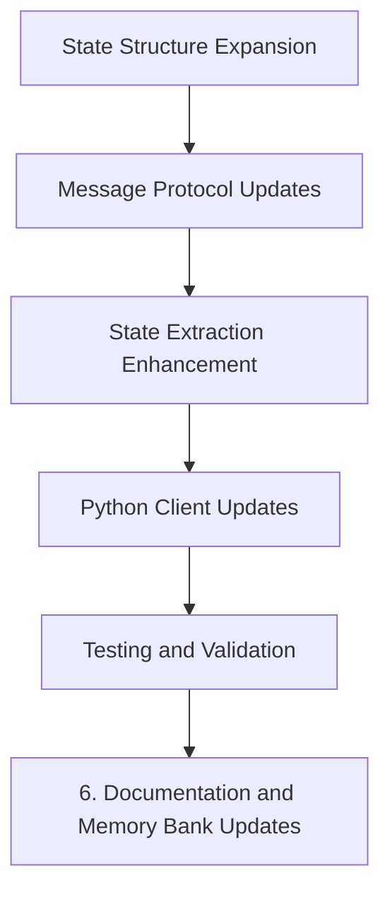

# API Expansion Implementation Plan

This document outlines the implementation plan for expanding the Magics API to better support reinforcement learning research by providing more comprehensive agent and environment data.

Take a look at on_robot_clicked in robots.rs

## Implementation Phases

## Phase 1: State Structure Expansion

1. **Update AgentState Structure**
   - Add new fields for mission state, planning strategy, physical properties
   - Implement factor details structures (variables, factors)
   - Create supporting enums and structs

2. **Enhance FactorGraphState Structure**
   - Add message statistics fields
   - Add factor count breakdown

3. **Expand EnvironmentState Structure**
   - Add fields for agent density, SDF resolution, world size

## Phase 2: Message Protocol Updates

1. **Create Serialized Structures**
   - Implement serialized versions of all new state structures
   - Ensure JSON compatibility for all types

2. **Implement From Conversions**
   - Create From trait implementations for converting between internal and serialized types
   - Handle special cases and nested structures

## Phase 3: State Extraction Enhancement

1. **Update extract_state Function**
   - Modify to extract all new fields from ECS components
   - Implement helper functions for complex data extraction
   - Connect to existing Bevy components and resources

## Phase 4: Python Client Updates

1. **Update MagicsClient Class**
   - Enhance get_agent_state and get_environment_state methods
   - Add helper methods for accessing specific information
   - Implement numpy array conversions for numerical data

2. **Create Type Hints and Documentation**
   - Add comprehensive docstrings
   - Create appropriate type hints for all methods

## Phase 5: Testing and Validation

1. **Create/Update Test Scripts**
   - Add tests for new API endpoints
   - Verify data extraction accuracy
   - Test serialization/deserialization

2. **Verify OpenAI Gym Compatibility**
   - Ensure new data structures work with Gym interfaces
   - Validate observation space compatibility

## Phase 6: Documentation and Memory Bank Updates

Throughout the implementation process, we'll update the Memory Bank files:

1. **activeContext.md**
   - Document what we're currently implementing
   - Track challenges and decisions made

2. **progress.md**
   - Update status of API expansion tasks
   - Mark completed elements

3. **systemPatterns.md**
   - Update API architecture diagrams if needed
   - Document any new design patterns introduced

## Checkpoint Strategy

We'll update the Memory Bank at these key points:
- After completing each major phase
- When making significant design decisions
- After implementing particularly complex components
- At the end of the session to document overall progress

## Implementation Status

- [✓] Config Hz Access - Already completed
- [✓] State Structure Expansion
  - [✓] Update AgentState Structure
  - [✓] Enhance FactorGraphState Structure
  - [✓] Expand EnvironmentState Structure
  - [✓] Implement Default trait for all structures
  - [✓] Add helper methods to ApiState
- [ ] Message Protocol Updates
  - [ ] Create Serialized Structures
  - [ ] Implement From Conversions
- [ ] State Extraction Enhancement
  - [✓] Updated framework for extract_state
  - [ ] Complete detailed data extraction for all fields
- [ ] Python Client Updates
  - [ ] Update MagicsClient Class
  - [ ] Create Type Hints and Documentation
- [ ] Testing and Validation
  - [ ] Create/Update Test Scripts
  - [ ] Verify OpenAI Gym Compatibility
- [✓] Documentation Updates
  - [✓] Updated Memory Bank (progress.md, activeContext.md)
