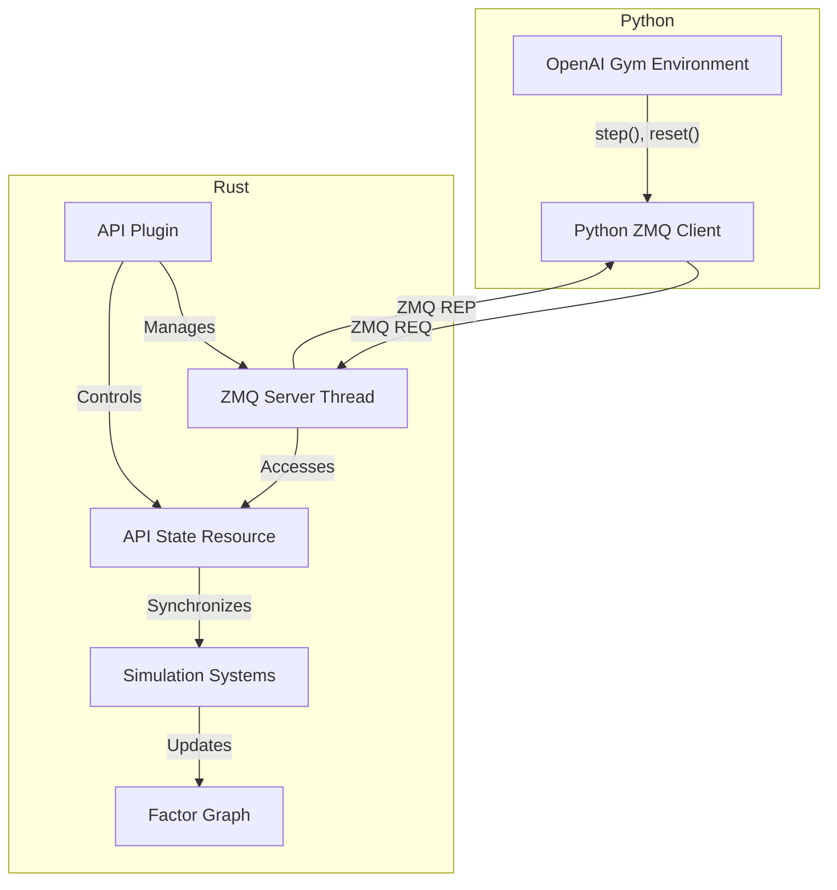
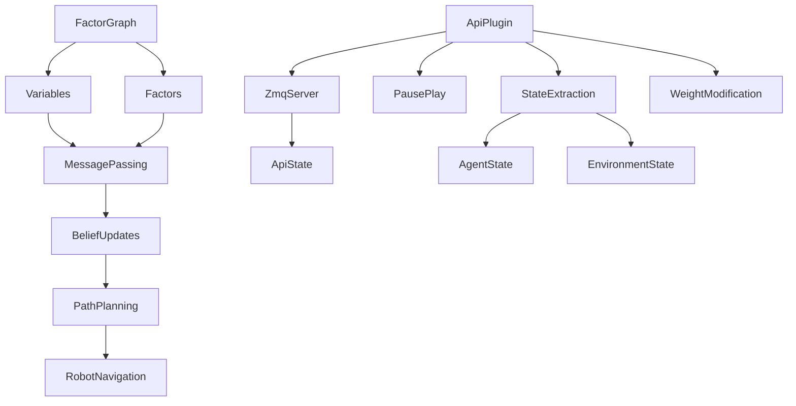
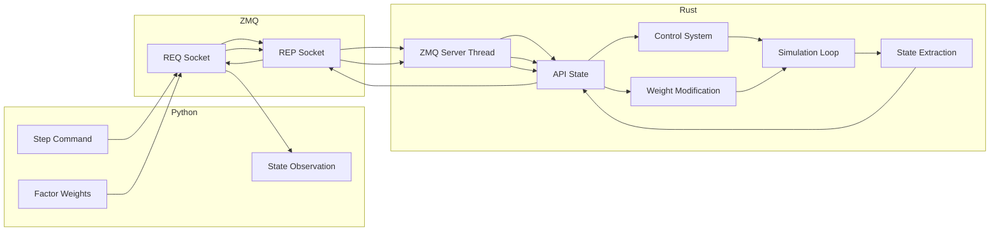

# System Patterns and Architecture

## Overall Architecture
Magics uses a modular, component-based architecture centered around the Factor Graph concept, now extended with a ZeroMQ-based API layer for external control and reinforcement learning integration.

## Core Architectural Components
1. Factor Graph
   - Represents probabilistic relationships between variables
   - Enables decentralized path planning
   - Supports multiple factor types:
     * Dynamic Factors
     * Obstacle Factors
     * Inter-robot Factors
     * Tracking Factors

2. Message Passing Mechanism
   - Implements Gaussian Belief Propagation
   - Bidirectional message exchange between variables and factors
   - Probabilistic belief updates

3. Simulation Framework
   - Bevy ECS for entity management
   - Modular plugin system
   - Configurable simulation parameters

4. ZeroMQ API Layer
   - REQ-REP socket pattern
   - JSON message serialization
   - Thread-safe state extraction
   - Step-based simulation control
   - Factor graph weight modification

## API Architecture

## Design Patterns
- Factor Graph Pattern
- Message Passing Pattern
- Probabilistic Inference
- Dependency Injection
- Plugin Architecture
- Actor Model (via ZeroMQ)
- Observer Pattern (for state extraction)
- Command Pattern (for step control)
- Strategy Pattern (for factor weight application)

## Key Technical Decisions
1. Language and Performance
   - Rust for high performance and memory safety
   - Minimal runtime overhead
   - Zero-cost abstractions

2. Probabilistic Modeling
   - Gaussian Belief Propagation algorithm
   - Probabilistic representation of robot states
   - Uncertainty-aware path planning

3. Modularity and Extensibility
   - Crate-based project structure
   - Flexible factor and variable definitions
   - Easy scenario configuration
   - Plugin-based API extension

4. API Design
   - ZeroMQ for language-agnostic communication
   - REQ-REP pattern for synchronous operations
   - JSON for human-readable message format
   - Thread-safe shared state

## Component Relationships

## API Data Flow

## Computational Complexity
- Message Passing: O(n) where n is number of factors/variables
- Path Planning: O(log n)
- Collision Avoidance: O(m²) where m is number of robots
- State Extraction: O(m) where m is number of agents
- API Communication: O(1) per request

## Constraints and Considerations
- Real-time performance requirements
- Probabilistic uncertainty management
- Scalability across different scenario complexities
- Thread safety for ZeroMQ server thread
- Consistent state representation for ML algorithms
- Timeout handling for synchronous operations
