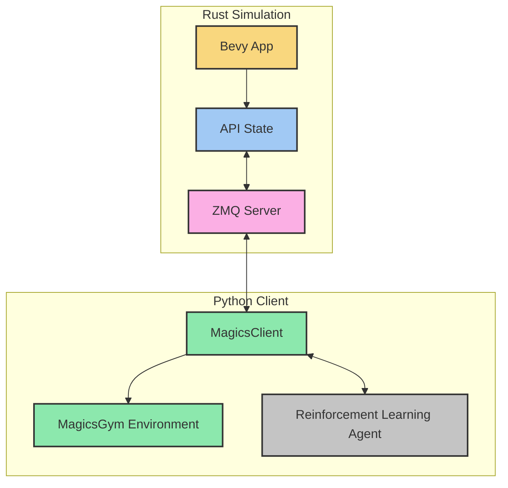
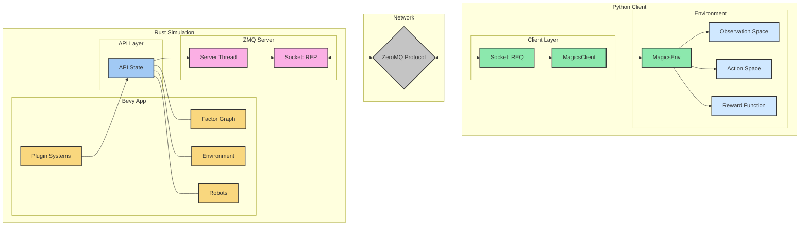
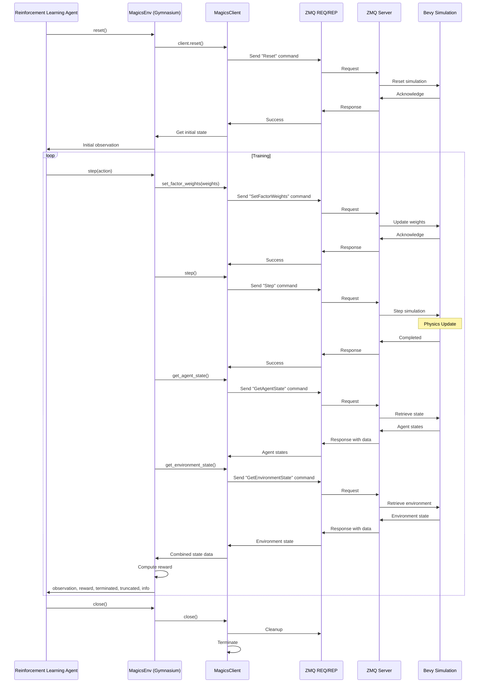
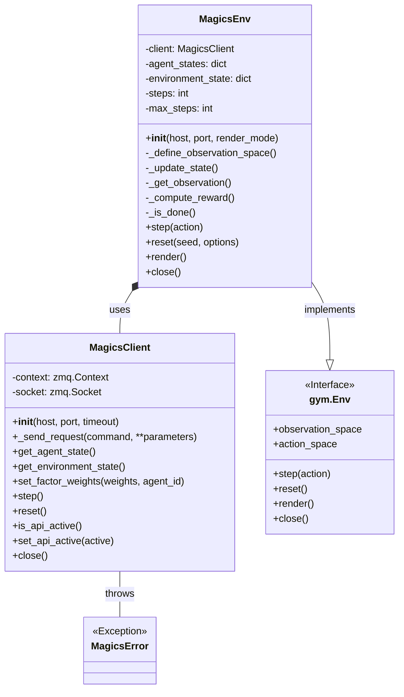

# Magics ZeroMQ Python API

This package provides a Python API for the Magics simulation using ZeroMQ for communication. It replaces the previous PyO3-based Python bindings with a more flexible and robust network-based approach.

## System Architecture

### Overview



### Detailed Component Diagram



### Communication Sequence



### Python Class Structure



## Contents

- `magics_client.py`: Direct ZeroMQ client for communicating with the Magics simulation
- `magics_gym`: OpenAI Gymnasium environment for reinforcement learning applications
- `example.py`: Example usage of both the direct client and the Gym environment
- `setup.py`: Installation script for the package

## Installation

### Prerequisites

- Python 3.8 or higher
- The Magics simulation running with the ZeroMQ API enabled
- Required Python packages: numpy, pyzmq, gymnasium

### Installing

Clone this repository and install the package:

```bash
# Install dependencies
pip install numpy pyzmq gymnasium

# Install the package in development mode
cd python_api
pip install -e .
```

## Usage

### Starting the Magics Simulation

Before using the API, you need to start the Magics simulation with the API feature enabled:

```bash
cd /path/to/magics
cargo run --features api
```

### Direct ZeroMQ Client

The `MagicsClient` class provides direct access to the Magics API:

```python
from magics_client import MagicsClient

# Connect to the Magics server
client = MagicsClient(host="localhost", port=5555)

# Activate the API
client.set_api_active(True)

# Get the state of all agents
agent_states = client.get_agent_state()

# Get the state of the environment
env_state = client.get_environment_state()

# Set factor weights
weights = {
    "dynamic": 1.0,
    "obstacle": 1.0,
    "interrobot": 1.0,
    "tracking": 1.0,
}
client.set_factor_weights(weights)

# Step the simulation
client.step()

# Close the connection
client.close()
```

### OpenAI Gym Environment

The `MagicsEnv` class provides an OpenAI Gymnasium environment for reinforcement learning:

```python
from magics_gym import MagicsEnv

# Create the environment
env = MagicsEnv()

# Reset the environment
observation, info = env.reset()

# Sample a random action
action = env.action_space.sample()

# Take a step in the environment
observation, reward, terminated, truncated, info = env.step(action)

# Close the environment
env.close()
```

## API Reference

### MagicsClient

- `__init__(host="localhost", port=5555, timeout=5000)`: Initialize the client with the given host, port, and timeout
- `get_agent_state()`: Get the state of all agents in the simulation
- `get_environment_state()`: Get the state of the environment
- `set_factor_weights(weights, agent_id=None)`: Set factor graph weights
- `step()`: Step the simulation forward by one frame
- `reset()`: Reset the simulation
- `is_api_active()`: Check if the API is active
- `set_api_active(active)`: Set the API active state
- `close()`: Close the connection

#### Agent State

The agent state returned by `get_agent_state()` includes the following fields:

- `position`: 2D position of the agent [x, y]
- `velocity`: 2D velocity of the agent [vx, vy]
- `factor_graph_state`: State of the agent's factor graph
- `connected_neighbors`: List of connected neighbor IDs
- `mission_state`: Current mission state of the agent
  - `IDLE`: Agent is idle, possibly waiting for waypoints
  - `ACTIVE`: Agent is actively following a route
  - `COMPLETED`: Agent has completed its mission
- `planning_strategy`: Planning strategy used by the agent
  - `ONLY_LOCAL`: Agent uses only local planning
  - `RRT_STAR`: Agent uses RRT* for global planning
- `radius`: Radius of the agent
- `communication_active`: Whether the agent's communication is active
- `communication_radius`: Communication radius of the agent
- `target_speed`: Target speed of the agent
- `current_waypoint_index`: Index of the current waypoint
- `next_waypoint`: Information about the next waypoint
- `goal_point`: Position of the goal point
- `mission_progress`: Mission progress information
- `factor_details`: Detailed information about factor graph components

### MagicsEnv

The `MagicsEnv` class implements the OpenAI Gymnasium interface:

- `__init__(host="localhost", port=5555, render_mode=None)`: Initialize the environment
- `step(action)`: Take a step in the environment
- `reset(seed=None, options=None)`: Reset the environment
- `render()`: Render the environment
- `close()`: Close the environment

#### Observation Space

The observation space is a dictionary with the following structure:

```python
{
    "agents": {
        "positions": Box(shape=(num_agents, 2)),  # Agent positions
        "velocities": Box(shape=(num_agents, 2)),  # Agent velocities
        "connectivity": Box(shape=(num_agents, num_agents)),  # Connectivity matrix
        "planning_strategies": MultiDiscrete([2] * num_agents),  # 0=OnlyLocal, 1=RrtStar
        "mission_states": MultiDiscrete([3] * num_agents),  # 0=Idle, 1=Active, 2=Completed
        "waiting_for_waypoints": MultiBinary(num_agents)  # Whether agents are waiting for waypoints
    },
    "obstacles": Box(shape=(num_obstacles, 2)),  # Obstacle positions
    "boundaries": Box(shape=(2, 2))  # Environment boundaries [min, max]
}
```

#### Action Space

The action space is a Box with shape (4,) representing the factor weights:
- `[dynamic, obstacle, interrobot, tracking]`

Each weight can range from 0.1 to 10.0.

## Comparison with PyO3-based API

This ZeroMQ-based API offers several advantages over the previous PyO3-based API:

1. **Network transparency**: The API can be used from any machine, not just the one running the simulation
2. **Language independence**: The protocol is language-agnostic, enabling easy implementation of clients in other languages
3. **Process isolation**: The simulation and client run in separate processes, improving stability
4. **Easier debugging**: The network layer makes it easier to debug API calls
5. **More scalable**: The architecture supports multiple clients connecting to the same simulation
6. **No compilation dependencies**: No need for PyO3 and Rust toolchain to install the Python package
7. **Modern Gymnasium interface**: Uses the latest Gymnasium API for reinforcement learning applications

## Running the Example

An example script is provided to demonstrate the use of both the direct client and the Gym environment:

```bash
python example.py
```

This script:
1. Connects to the Magics simulation
2. Gets the state of the environment and agents
3. Sets factor weights and steps the simulation
4. Creates a Gym environment and runs it for a few steps with random actions
